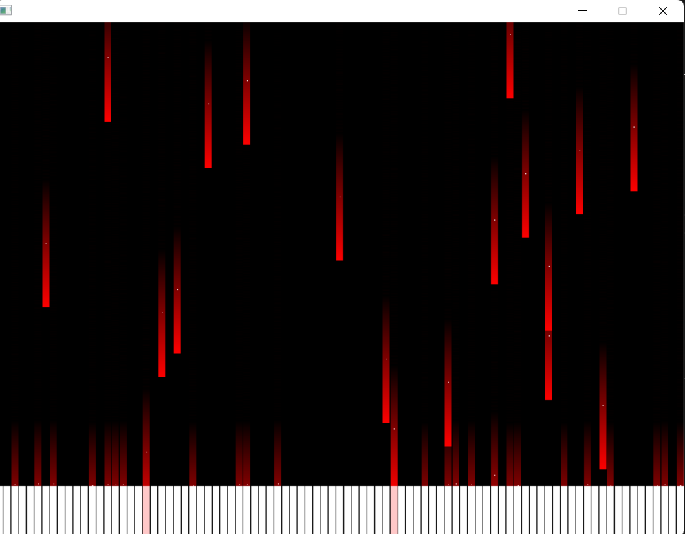

# Piano Audio Transcription

This project is designed to transcribe piano audio into piano notes and generate a corresponding video visualization. It leverages advanced signal processing techniques and video computation to achieve its goals.
It takes and audio file [audio.wav](./bin/audio.wav) and then generate a piano tutorial video for this audio.




## Features

### Piano Audio to Piano Notes
The `piano_audio_to_piano_note` function is the core of the transcription process. It utilizes signal processing knowledge, specifically the Fast Fourier Transform (FFT), to analyze and extract frequencies and then to map thoses frequencies on piano notes from audio input.

### Piano Notes to Video
The `piano_notes_to_video` function takes the extracted piano notes and generates a video visualization. This requires computing video frames using SDL.

## What I've Learned
Through the development of this project, I have gained valuable experience in the following areas:
- **Signal Processing**: Understanding and applying the Fast Fourier Transform (FFT) to analyze audio signals.
- **Video Computation**: Utilizing SDL to generate graphical assets and to create video visualizations from processed data.

## Getting Started
To get started with this project, clone the repository and follow the instructions in the code comments. Ensure you have the necessary dependencies for signal processing and SDL.

```
git clone https://github.com/Alexndrs/Piano-audio-transcription.git
```

## Dependencies
- C (99.2%)
- Other (0.8%)
- SDL (for video computation)
- Signal processing libraries (for FFT)

## Usage
1. Use the `piano_audio_to_piano_note` function to transcribe audio into notes.
2. Use the `piano_notes_to_video` function to generate a video from the transcribed notes.

## Contributing
Feel free to open issues or submit pull requests if you have suggestions or improvements.
We acknowledge that some error has been made while choosing the threshold for the noise, we should have calculate this threshold based on the energy of the whole signal. This is a potential change that might really improve the performances of this project.

## License
This project is licensed under the MIT License.
---

Feel free to modify and expand upon this draft to suit your needs.
